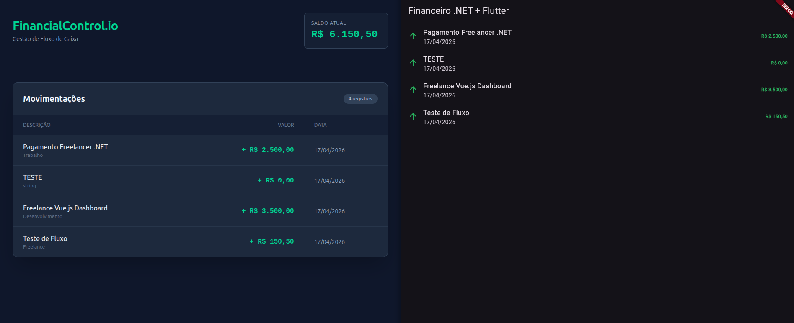

# FinancialControl.io

Sistema completo de controle financeiro multiplataforma desenvolvido com
foco em escalabilidade, mensageria e arquitetura limpa.

---

## Arquitetura do Projeto

O sistema foi projetado seguindo princípios de **Clean Architecture + DDD (Domain-Driven Design)**, com separação clara de responsabilidades:

Api → Application → Domain ← Infrastructure

---

### Camadas

- Domain: regras de negócio, entidades e validações
- Application: casos de uso (commands e queries)
- Infrastructure: acesso a dados e integrações externas
- API: camada de entrada (HTTP)

---

## Principais Evoluções Arquiteturais

- Introdução de UseCases (Command + Query)
- Remoção de lógica dos controllers
- Implementação de DDD básico (entidade rica)
- Separação entre entrada (DTO) e domínio
- Orquestração centralizada na camada de aplicação
- Uso de eventos assíncronos (RabbitMQ + MassTransit)
- Testes unitários com mock de dependências
- Código preparado para escalabilidade e manutenção

---

### Tecnologias Principais

- Back-end: .NET 8 (C#)
- Front-end Web: React + TypeScript + Tailwind CSS
- Mobile: Flutter (Dart)
- Banco de Dados: PostgreSQL
- Mensageria: RabbitMQ + MassTransit
- Testes: xUnit + Moq
- Containerização: Docker & Docker Compose

---

## Estrutura do Backend

```plaintext
src/
├── FinancialControl.Api            # Camada de entrada (HTTP)
├── FinancialControl.Application    # Casos de uso
├── FinancialControl.Domain         # Regras de negócio
├── FinancialControl.Infrastructure # Banco e integrações
└── FinancialControl.Worker         # Processamento assíncrono
```

---

## Padrões Utilizados

- Clean Architecture
- Domain-Driven Design (DDD)
- Dependency Injection
- Event-Driven Architecture
- Separation of Concerns
- SOLID

---

## Fluxo de Criação de Transação

1. Controller recebe requisição HTTP
2. Envia para o UseCase
3. UseCase:
   - Cria entidade com regras de domínio
   - Persiste via repository
   - Publica evento no RabbitMQ
4. Worker processa o evento

---

## Testes

Executar:

```bash
dotnet test
```

---

## Módulos do Sistema

### 1. API Central (.NET 8)

- Implementação de **Clean Architecture** (Domain, Application,
  Infrastructure, Api).
- **Entity Framework Core** para persistência no PostgreSQL.
- **FluentValidation** para regras de entrada de dados.
- **CORS** configurado para múltiplos ambientes (Web e Mobile).
- **Swagger/OpenAPI** para documentação e testes de endpoints.

### 2. Dashboard Web (React)

- SPA moderna focada em gestão de fluxo de caixa.
- Consumo de API via **Axios**.
- Estilização responsiva com **Tailwind**.

### 3. Mobile App (Flutter)

- Aplicativo multiplataforma para acompanhamento em tempo real.
- Gerenciamento de estado e consumo de API com **Dio**.
- Formatação de moeda brasileira com o pacote **Intl**.

### 4. Background Worker (Mensageria)

- Processamento assíncrono de transações via **RabbitMQ**.
- Utilização de **MassTransit** para abstração de barramento de
  eventos.

---

## Como Rodar o Projeto

### Pré-requisitos

- .NET 8 SDK
- Node.js & npm
- Flutter SDK
- Docker & Docker Compose

### Passo a Passo

#### 1. Subir os serviços (PostgreSQL & RabbitMQ)

```bash
docker-compose up -d
```

#### 2. Rodar a API

```bash
cd src/FinancialControl.Api
dotnet run
```

#### 3. Rodar o Dashboard React

```bash
cd src/FinancialControl.Desktop
npm install
npm run dev
```

#### 4. Rodar o App Flutter (Web)

```bash
cd src/financial_control_mobile
flutter run -d chrome --web-port 5174
```

---

## Demonstração do Ecossistema

<p align="center">
  
</p>

---

## Status do Projeto

- [x] API com PostgreSQL integrada.
- [x] Integração com RabbitMQ concluída.
- [x] Dashboard React funcional.
- [x] App Flutter (v1) integrado.
- [ ] Cadastro de novas transações via Mobile.
- [ ] Gráficos de performance financeira.

---

## Autor

Desenvolvido por **Bruno Ramos**\
Portfolio: [brunoramos.tec.br](https://brunoramos.tec.br/)
