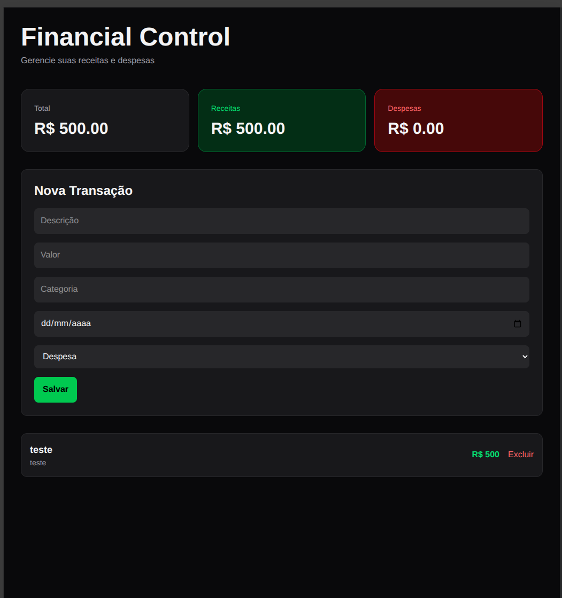
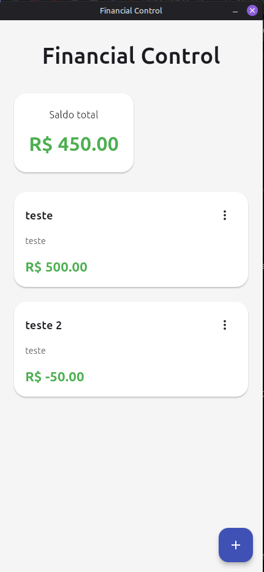

# Financial Control

Sistema de controle financeiro desenvolvido com foco em arquitetura limpa, desacoplamento e escalabilidade.

---

## Visão Geral

O projeto foi construído utilizando os princípios de:

- Clean Architecture
- Domain-Driven Design (DDD)
- SOLID
- Event-Driven Architecture

O objetivo principal deste projeto é estudar e aplicar conceitos modernos de arquitetura backend utilizando .NET 8.

Além da API, o projeto também possui:

- uma interface web em React;
- uma aplicação mobile/desktop em Flutter.

---

## Arquitetura

Atualmente o sistema utiliza o padrão de **Monólito Modular (Modular Monolith)**.

A escolha dessa arquitetura foi feita propositalmente para permitir:

- entendimento profundo do domínio;
- separação clara de responsabilidades;
- baixo acoplamento entre camadas;
- facilidade de manutenção;
- preparação futura para microserviços.

Mesmo sendo um monólito, o sistema já foi estruturado de forma desacoplada, permitindo evolução gradual para uma arquitetura distribuída futuramente.

---

## Estrutura do Projeto

```text
FinancialControl.Api
FinancialControl.Application
FinancialControl.Domain
FinancialControl.Infrastructure
FinancialControl.Worker
financial-control-frontend
financial_control_mobile
```

---

## Responsabilidades

| Projeto                         | Responsabilidade                      |
| ------------------------------- | ------------------------------------- |
| FinancialControl.Api            | Exposição das rotas HTTP              |
| FinancialControl.Application    | Casos de uso da aplicação             |
| FinancialControl.Domain         | Regras de negócio e entidades         |
| FinancialControl.Infrastructure | Banco de dados e integrações externas |
| FinancialControl.Worker         | Processamento assíncrono de eventos   |
| financial-control-frontend      | Interface web React                   |
| financial_control_mobile        | Aplicação Flutter                     |

---

## Tecnologias Utilizadas

### Backend

- .NET 8
- ASP.NET Core
- Entity Framework Core
- PostgreSQL
- RabbitMQ
- MassTransit
- xUnit
- Moq

### Frontend Web

- React
- TypeScript
- Vite
- Axios
- TailwindCSS

### Mobile/Desktop

- Flutter
- Dart

### DevOps

- Docker
- Docker Compose

---

## Funcionalidades

- Criar transações
- Listar transações
- Atualizar transações
- Remover transações
- Dashboard financeiro
- Totalizador de saldo
- Processamento assíncrono com eventos
- Testes unitários
- API documentada com Swagger

---

## Interface Web

### Dashboard React



---

## Interface Flutter

### Dashboard Flutter



---

## Como Executar

### Subir containers

```bash
docker compose up --build
```

---

## Backend

API:

```text
http://localhost:8080
```

Swagger:

```text
http://localhost:8080/swagger
```

---

## Frontend React

Entrar na pasta:

```bash
cd src/financial-control-frontend
```

Instalar dependências:

```bash
npm install
```

Executar:

```bash
npm run dev
```

Aplicação:

```text
http://localhost:5173
```

---

## Frontend Flutter

Entrar na pasta:

```bash
cd src/financial_control_mobile
```

Instalar dependências:

```bash
flutter pub get
```

Executar:

```bash
flutter run
```

---

## Observação sobre o Flutter

A aplicação Flutter está sendo executada fora do Docker propositalmente.

O objetivo é utilizar o projeto também como ambiente de estudo da stack Flutter, permitindo:

- entendimento do ecossistema Flutter;
- execução local simplificada;
- debug mais rápido;
- aprendizado da configuração nativa;
- testes em Linux, Android e Web futuramente.

Em um cenário de produção, a aplicação pode ser facilmente adaptada para conteinerização e pipelines CI/CD.

---

## Executar Migrations

Caso o banco esteja rodando via Docker:

```bash
dotnet ef database update \
  --project src/FinancialControl.Infrastructure \
  --startup-project src/FinancialControl.Api \
  --connection "Host=localhost;Port=5440;Database=financial_control;Username=postgres;Password=postgres"
```

---

## Executar Testes

```bash
dotnet test
```

---

## Objetivo do Projeto

Este projeto está sendo utilizado como laboratório prático para aprofundamento em:

- arquitetura de software;
- design de domínio;
- comunicação assíncrona;
- testes automatizados;
- conteinerização;
- Flutter;
- organização de sistemas escaláveis.

A ideia é evoluir gradualmente a aplicação, mantendo uma base sólida e preparada para crescimento.

---

## Próximos Passos

- autenticação JWT;
- dashboard com gráficos;
- filtros e paginação;
- CI/CD;
- observabilidade;
- deploy em cloud;
- sincronização offline no Flutter;
- possível separação futura em microserviços.

---

## Autor

Bruno Ramos

Portfolio:

[www.brunoramos.tec.br](https://www.brunoramos.tec.br)
